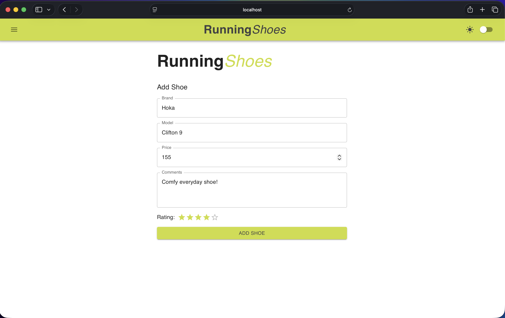
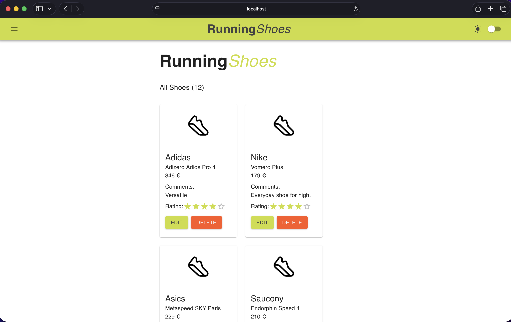
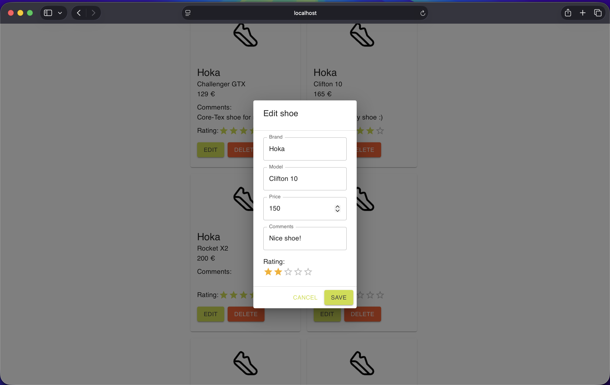

# 🏃 RunningShoes  

RunningShoes is a full-stack CRUD web application for runners to manage and track their shoe collection and rotation, including comments and rating.    
The project consists of a React frontend and a Node.js/Express backend with a SQLite database.   

## 🧠 Why I Built This  

I built RunningShoes to solve a common problem among runners – keeping track of shoe rotation and to add notes for each shoe.  
This project helped me strengthen my full-stack development skills, especially working with REST APIs, state management in React and structuring a backend with Express. 

## 📸 Preview  

The following screenshots demonstrate the main UI states of the application.

### 🏠 Landing Page
 
The 'GET STARTED' button links to the add shoe form.

### 🏠 Add Shoe
 
The form for adding new shoe pair.

### 👟 Shoe Collection

Displays all saved running shoes with edit/delete functionality.

### ✏️ Edit Shoe

Pop-up window for editing shoe (brand, model, price, comments and rating).

### 🌙 Dark Mode

User can toggle between light and dark mode using switch in the top-right corner.

## 📦 Product Overview 

This application allows users to:
-	Add running shoes to their collection
-	View all shoes in a list
-	Update shoe details
-	Delete shoes
-	Search and manage shoe data
Data is persisted using a SQLite database via a REST API built using Express.

## ⚙️ Architecture
-	Frontend: React (Vite), Material UI
-	Backend: Node.js, Express
-	Database: SQLite3
-	Communication: REST API (Axios HTTP requests)

Frontend and backend run as separate services during development.  

This project is intended for local development and learning purposes.

## ✨ Features
-	Add, update, delete running shoes (CRUD)
-	View shoe collection in a structured list
-	Search functionality
-	Light / Dark mode UI
-	Responsive Material UI design
-	REST API integration

## 📡 API Endpoints

Base URL: `http://localhost:3000`

### Shoes

| Method | Endpoint | Description |
|------|--------|------------------------|
|GET | /shoes | Get all shoes |
|GET | /shoes/:id | Get single shoe |
|POST | /shoes | Create new shoe |
|PUT | /shoes/:id | Update existing shoe |
|DELETE | /shoes/:id | Delete shoe |

## Running the Project Locally

### Backend  

```bash
cd backend
npm install
node server.cjs
```
Backend runs on http://localhost:3000  

### Frontend
```bash
cd src
npm install
npm run dev
```

Frontend runs on http://localhost:5173

### Database  

The project uses SQLite.
The database file is automatically created when the backend is first started:
```bash
backend/database.sqlite
```

Table schema:
-	id (integer, primary key)
-	brand (text, required)
-	model (text, required)
-	price (integer)
-	comments (text)
-	grade (integer)
 

## 🚧 Future Improvements
  
Possible enhancements:
-	JWT authentication
-	User accounts
-	Integration with external running APIs (e.g. Strava) for mileage tracking per shoe

## 👤 Author  

Atte Ampuja – [GitHub](https://github.com/Atte-A) | [LinkedIn](https://www.linkedin.com/in/atteampuja)

## ⚖️ License  

MIT
